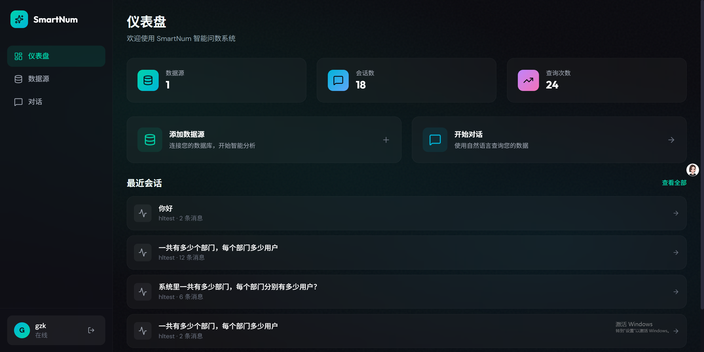
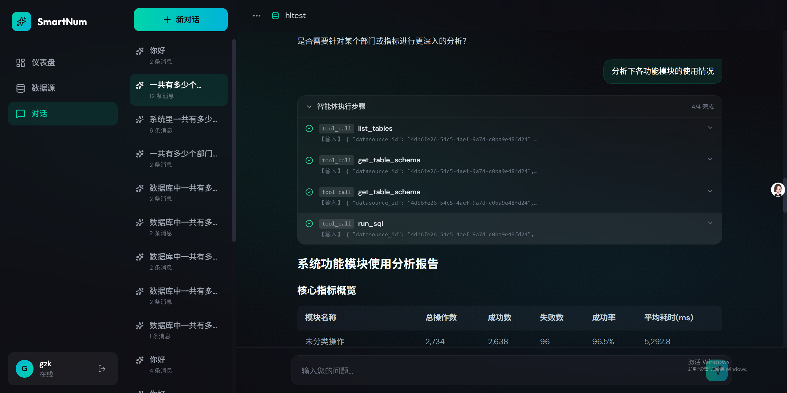
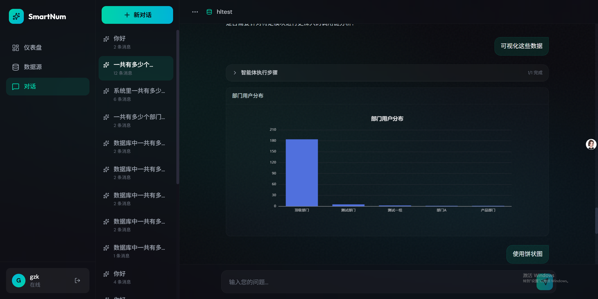
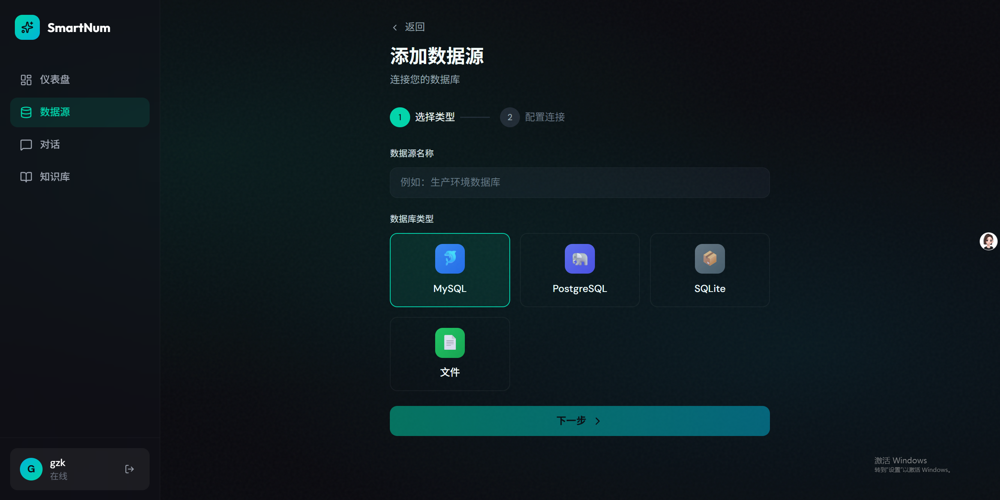
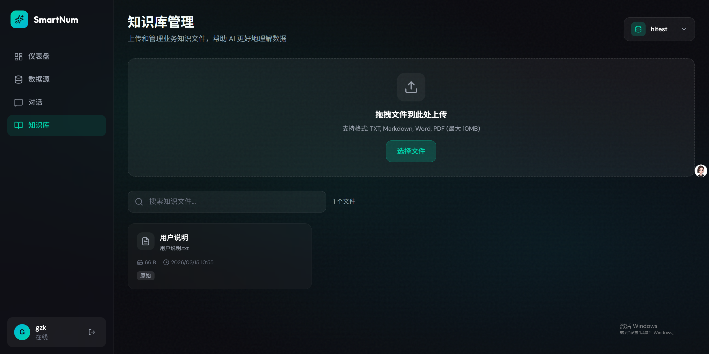

# SmartNum

<p align="center">
  <strong>智能问数系统 - 让数据查询像对话一样简单</strong>
</p>

<p align="center">
  <a href="#功能特性">功能特性</a> •
  <a href="#快速开始">快速开始</a> •
  <a href="#界面预览">界面预览</a> •
  <a href="#技术架构">技术架构</a> •
  <a href="docs/产品文档.md">完整文档</a>
</p>

---

## 简介

SmartNum 是一款智能问数系统，让非技术用户也能通过自然语言查询数据库。用户只需用日常语言提问，系统会自动将问题转换为 SQL 并执行，返回查询结果。

### 核心价值

| 特性 | 说明 |
|------|------|
| 🗣️ **自然语言交互** | 无需学习 SQL，用日常语言提问即可获得数据 |
| 🔄 **多轮对话** | 支持追问和深入分析，逐步细化数据洞察 |
| 📄 **文件数据源** | 上传 CSV/Excel 文件，直接用自然语言分析 |
| 📚 **知识库** | 上传业务文档，让 AI 理解业务规则和数据字典 |
| 📖 **查询指南** | 为数据源添加表说明、业务规则、SQL 参考，提升查询准确度 |
| 📊 **数据可视化** | 自动生成 ECharts 图表，支持多种图表类型 |
| 📤 **数据导出** | 支持 CSV、Excel 格式导出 |
| 🔒 **安全可靠** | SQL 注入防护、敏感数据保护、JWT 认证 |
| 👤 **用户系统** | 完整的登录注册系统，数据隔离存储 |

---

## 功能特性

### 🎯 智能问答

- **自然语言转 SQL**：基于 DeepAgents 框架，智能理解用户意图
- **多轮对话**：支持上下文追问、条件筛选、维度下钻
- **实时反馈**：SSE 流式响应，实时展示智能体执行步骤

### 📚 知识库

- **文档上传**：支持 TXT、Markdown、Word、PDF 格式
- **数据源隔离**：每个数据源独立管理知识文件
- **智能探索**：AI 可自由探索知识库，理解业务规则
- **业务规则**：上传数据字典、字段说明、注意事项等

### 📖 查询指南

- **文档上传**：支持 TXT、Markdown、Word、PDF 格式
- **手动备注**：内置 Markdown 编辑器，快速添加表说明和 SQL 参考
- **智能探索**：AI 在查询前可自由探索查询指南，理解业务逻辑
- **侧边编辑**：抽屉式编辑界面，上传文档和编写备注一站式完成

### 📈 数据可视化

- **多种图表**：柱状图、折线图、饼图、散点图、面积图
- **智能生成**：用户要求可视化时自动生成 ECharts 配置
- **交互式展示**：支持图表缩放、数据提示等交互功能

### 📤 数据导出

- **多格式支持**：CSV、Excel (.xlsx)
- **一键下载**：生成文件后直接下载
- **大文件支持**：自动截断提示，防止内存溢出

### 🔐 安全机制

- **SQL 注入防护**：只允许 SELECT 语句
- **密码加密**：bcrypt 加密存储
- **JWT 认证**：Token 有效期 24 小时
- **查询超时**：默认 30 秒超时保护

---

## 界面预览

### 仪表盘



展示数据源数量、会话数、查询次数等关键指标，快速开始新对话。

### 智能对话



支持自然语言提问，实时展示智能体执行步骤，结果以 Markdown 表格呈现。

### 数据可视化



用户要求可视化时，自动生成美观的 ECharts 图表。

### 数据源管理



支持 MySQL、PostgreSQL、SQLite 数据库连接，以及 CSV/Excel 文件上传。

### 知识库管理



上传业务知识文件，帮助 AI 理解业务规则和数据字典。

---

## 快速开始

### 环境要求

- Python >= 3.10
- Node.js >= 18.0
- MySQL >= 8.0
- Docker & Docker Compose (可选)

### 方式一：Docker 部署（推荐）

```bash
# 1. 克隆项目
git clone https://github.com/GZK66666/smartNum.git
cd smartNum

# 2. 配置环境变量
cp .env.example .env
# 编辑 .env 文件，填写 LLM API Key 和 MySQL 连接信息

# 3. 初始化数据库（首次部署）
mysql -h <your-mysql-host> -u root -p -e "CREATE DATABASE smartnum CHARACTER SET utf8mb4;"
mysql -h <your-mysql-host> -u root -p smartnum < init_db.sql

# 4. 启动服务
docker-compose up -d

# 5. 查看日志
docker-compose logs -f
```

**访问应用**：http://localhost（默认端口 80）

**停止服务**：`docker-compose down`

### 方式二：本地开发

```bash
# 1. 克隆项目
git clone https://github.com/GZK66666/smartNum.git
cd smartNum

# 2. 初始化数据库
mysql -u root -p -e "CREATE DATABASE smartnum CHARACTER SET utf8mb4;"
mysql -u root -p smartnum < init_db.sql

# 3. 配置后端
python -m venv venv
source venv/bin/activate  # Linux/Mac
# venv\Scripts\activate  # Windows
pip install -r requirements.txt
cp .env.example .env
# 编辑 .env 配置数据库连接和 LLM API Key

# 4. 启动后端
uvicorn app.main:app --reload --port 8000

# 5. 启动前端（新终端）
cd frontend
npm install
npm run dev
```

### 访问应用

- 前端界面：http://localhost（Docker）或 http://localhost:5173（本地开发）
- API 文档：http://localhost:8000/docs

---

## 技术架构

### 技术栈

| 层级 | 技术 |
|------|------|
| 前端 | React 18 + TypeScript + TailwindCSS + ECharts |
| 后端 | Python + FastAPI + SQLAlchemy (异步) |
| AI | LangChain + DeepAgents |
| 数据库 | MySQL (系统库) + MySQL/PostgreSQL/SQLite (业务库) + DuckDB (文件查询) |
| 认证 | JWT + bcrypt |

### 系统架构

```
┌─────────────────────────────────────────────────────────────┐
│                    Frontend (React + Vite)                   │
│  ┌────────────┐ ┌────────────┐ ┌────────────┐ ┌──────────┐ │
│  │  登录注册   │ │  仪表盘    │ │  数据源    │ │  对话    │ │
│  └────────────┘ └────────────┘ └────────────┘ └──────────┘ │
│  ┌────────────┐                                              │
│  │  知识库    │                                              │
│  └────────────┘                                              │
└─────────────────────────────────────────────────────────────┘
                              │ HTTP/SSE
┌─────────────────────────────────────────────────────────────┐
│                    Backend (FastAPI)                         │
│  ┌──────────────────────────────────────────────────────┐  │
│  │ API Layer: Auth │ DataSource │ Session │ Knowledge   │  │
│  └──────────────────────────────────────────────────────┘  │
│  ┌──────────────────────────────────────────────────────┐  │
│  │ Service Layer: UserService │ DataSourceService │ ...  │  │
│  └──────────────────────────────────────────────────────┘  │
│  ┌──────────────────────────────────────────────────────┐  │
│  │ Agent Layer: DeepAgents (Text2SQL + Knowledge + Viz) │  │
│  └──────────────────────────────────────────────────────┘  │
└─────────────────────────────────────────────────────────────┘
                              │
┌─────────────────────────────────────────────────────────────┐
│                    MySQL (系统数据库)                         │
│         users │ datasources │ sessions │ messages           │
│                       │ knowledge_files                      │
└─────────────────────────────────────────────────────────────┘
                              │
┌─────────────────────────────────────────────────────────────┐
│                    知识库文件存储                             │
│              data/knowledge/{datasource_id}/                 │
│                   raw/ │ processed/                          │
└─────────────────────────────────────────────────────────────┘
```

---

## 项目结构

```
smartNum/
├── app/                      # 后端代码
│   ├── main.py               # FastAPI 入口
│   ├── core/                 # 核心模块 (配置、安全、JWT)
│   ├── models/               # 数据模型 (ORM、Pydantic)
│   ├── routers/              # API 路由
│   │   ├── auth.py           # 认证路由
│   │   ├── datasources.py    # 数据源路由
│   │   ├── sessions.py       # 会话路由
│   │   └── knowledge.py      # 知识库路由
│   └── services/             # 业务服务
│       ├── agent_service.py  # 智能体服务
│       ├── knowledge_service.py  # 知识库服务
│       └── ...
├── frontend/                 # 前端代码
│   ├── src/
│   │   ├── components/       # UI 组件
│   │   ├── pages/            # 页面
│   │   │   ├── DashboardPage.tsx
│   │   │   ├── ChatPage.tsx
│   │   │   ├── KnowledgePage.tsx
│   │   │   └── ...
│   │   ├── services/         # API 服务
│   │   └── types/            # TypeScript 类型
│   └── package.json
├── data/                     # 数据存储
│   └── knowledge/            # 知识库文件
│       └── {datasource_id}/  # 按数据源隔离
│           ├── raw/          # 原始文件
│           └── processed/    # 处理后的文本
├── docs/                     # 文档
├── imgs/                     # 截图
├── init_db.sql               # 数据库初始化脚本
└── README.md
```

---

## 文档

- [产品文档](docs/产品文档.md) - 完整的产品功能说明
- [更新日志](docs/更新日志.md) - 版本更新记录

---

## License

MIT License

---

<p align="center">
  Made with ❤️ by SmartNum Team
</p>